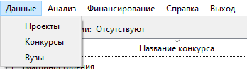
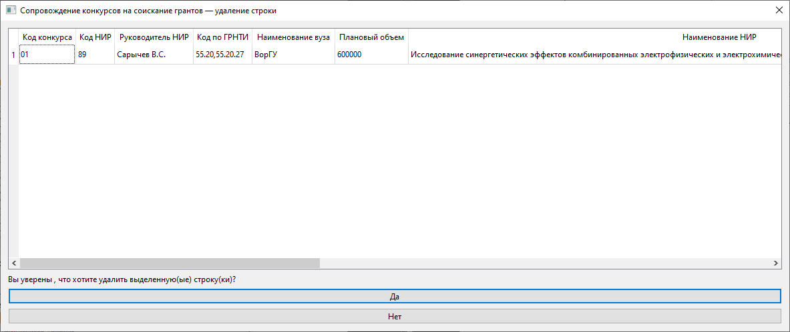
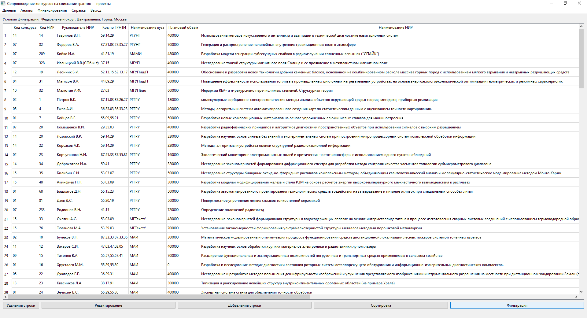
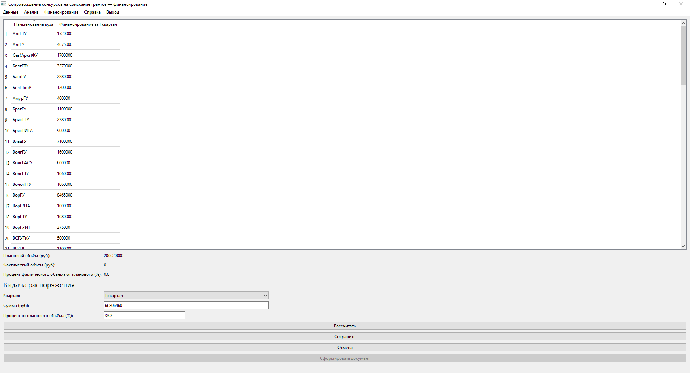
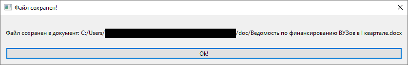

**Аннотация**

Данная программа предназначена для сопровождения конкурсов на соискание грантов в вузах РФ и обеспечивает ввод, хранение и обработку данных о НИР, выполняемых по результатам конкурсов на соискание грантов, реализацию функции сопровождения НИР по грантам.

Результатом данной программы является просмотр, редактирование, добавление, упорядочивание, фильтрация и анализ данных; реализация отчётных форм, сохранение полученной информации в отчёт, выдача распоряжения по финансированию.

# **Оглавление**

0. [Введение](#intro)
1. [Техническое задание на разработку](#spec)
2. [Проект информационной системы](#proj)

   2.1. [Основные функции информационной системы](#func)

   2.2. [Информационная структура системы](#struct)

   2.3. [Модульная структура системы](#mod)

4. [Документация информационной системы](#doc)

   3.1. [Краткое описание и назначение системы](#sys)

   3.2. [Руководство пользователя](#user)

   3.3. [Руководство администратора системы](#admin)

4. [Демонстрация работы](#demo)
5. [Заключение](#conc)
6. [Список использованных источников](#lit)

# **Введение** 
Данная программа предназначена для сопровождения конкурсов на соискание грантов. Эта область требует обработки больших объёмов информации при сохранении её целостности. В работе используются данные о НИР, выполняемых по грантам, данные о конкурсах на соискание грантов, данные о вузах. Эти данные структурированы и представлены в виде таблиц. Для формирования такого рода данных целесообразно использовать информационную систему, которая будет удовлетворять функциональным требованиям.

Программа позволяет осуществлять взаимодействие с данными, выпускать распоряжения и формировать отчётные документы.

Документ содержит разделы о техническом задании на разработку, о проекте информационной системы, о документации информационной системы, о результатах испытания системы.

# **Техническое задание на разработку**

**Объект** информационной технологии: управление организацией и сопровождением проведения научно-исследовательских работ (НИР) по грантам.

**Цель разработки**: создание программных средств, обеспечивающих ввод, хранение и обработку данных о НИР, выполняемых по результатам конкурсов на соискание грантов, реализацию функций сопровождения НИР по грантам.

**Информационный  базис**: данные о НИР, выполняемых по грантам, данные о конкурсах на соискание грантов, данные о вузах.

**Гранты**: денежные и иные средства, передаваемые безвозмездно и безвозвратно гражданам и юридическим лицам на проведение конкретных научных исследований на условиях, предусмотренных грантодателями.

**Требования к разработке приложения**: для обработки и анализа данных.

Приложение должно реализовывать следующие функции:

а) контроль и восстановление целостности исходных баз данных системы;

б) просмотр информации о конкурсах на соискание грантов и о НИР, выполняемых по грантам, фильтрация и упорядочивание информации при просмотре, добавление и редактирование информации, обеспечение целостности данных;

в) реализация отчетных (табличных) форм распределения НИР по вузам, по конкурсам грантов, по субъектам федерации, с сохранением условий фильтрации информации, заданной при просмотре; формирование документов;

г) реализация функции выпуска распоряжения по финансированию НИР с формированием ведомости по вузам в виде документа.

# **Проект информационной системы** 

## **Основные функции информационной системы** 

Основными функциями информационной системы являются: 
- Отображение данных: таблицы с информацией о НИР, данные о конкурсах на соискание грантов, данные о вузах
- Операции с таблицей и информацией о НИР
  - Сортировка данных
  - Фильтрация по конкурсу, по Федеральному округу, по Субъекту РФ, по городу, по вузу
  - Добавление и редактирование записей
    - Проверка целостности вносимых данных
    - Выделение добавленной/редактируемой записи в таблице
  - Удаление записей
    - Запрос на подтверждение удаления
- Просмотр форм анализа данных 
  - Применение условий фильтрации к анализируемым данным
  - Сохранение отчетных документов с отображением условий фильтрации
- Выпуск распоряжения по поквартальному финансированию вузов.
  - Расчет финансирования для каждого вуза
  - Сохранение распоряжения в документ 

Рис. 1. Функции информационной системы.

## **Информационная структура системы.** 
Исходные таблицы: **vuz** (информация по ВУЗам), **gr_konk** (информация по конкурсам), **gr_proj** (информация по проектам).

Рис. 2.  Инфологическая модель базы данных.

Таблица **vuz**

|**Ключ**|**Имя столбца**|**Тип данных**|**Описание**|
| :-: | :-: | :-: | :-: |
|+|codvuz|INTEGER|Код вуза|
||z1|TEXT|Наименование вуза|
||z1full|TEXT|Полное юридическое наименование|
||z2|TEXT|Сокращенное наименование|
||region|TEXT|Федеральный округ|
||city|TEXT|Город|
||status|TEXT|Статус вуза|
||obl|INTEGER|Номер субъекта федерации|
||oblname|TEXT|Субъект федерации|
||gr_ved|TEXT|Принадлежность к ведущим вуза (ФУ-федеральный округ , НИУ-национальный исследовательский университет)|
||oblname|TEXT|Профиль вуза : ИТ-инженерно-технический, КЛ-классический университет, ГП-гуманитарно-педагогический, МП-многопрофильный|

Таблица **gr_konk**

|**Ключ**|**Имя столбца**|**Тип данных**|**Описание**|
| :-: | :-: | :-: | :-: |
||k2|TEXT|Название конкурса на соискание грантов|
|+|codkon|TEXT|Код конкурса|
||k12|INTEGER|Плановый объем финансирования|
||k4|INTEGER|Фактический объем финансирования|
||k41|INTEGER|Фактическое финансирование вузов в I квартале|
||k42|INTEGER|Фактическое финансирование вузов во II квартале|
||k43|INTEGER|Фактическое финансирование вузов в III квартале|
||k43|INTEGER|Фактическое финансирование вузов в IV квартале|
||npr|INTEGER|Количество НИР по грантам|

Таблица **gr_proj**

|**Ключ**|**Имя столбца**|**Тип данных**|**Описание**|
| :-: | :-: | :-: | :-: |
|+|g1|INTEGER|Код НИР|
|+|codkon|TEXT|Код конкурса|
||codvuz|INTEGER|Код вуза|
||g7|TEXT|Код по ГРНТИ|
||g5|INTEGER|Плановый объем гранта|
||g2|INTEGER|Фактический объем гранта|
||g21|INTEGER|Фактическое финансирование вузов в I квартале|
||g22|INTEGER|Фактическое финансирование вузов во II квартале|
||g23|INTEGER|Фактическое финансирование вузов в III квартале|
||g24|INTEGER|Фактическое финансирование вузов в IV квартале|
||g6|INTEGER|Наименование НИР|
||g8|INTEGER|Руководитель НИР|
||g9|INTEGER|Должность руководителя|
||g10|INTEGER|Ученое звание руководителя|
||g11|INTEGER|Ученая степень руководителя|

## **Модульная структура информационной системы.** 
Информационную систему можно разбить на следующие модули:

1) Данные

   а) Таблица НИР

   б) Таблица распределения по конкурсам

   в) Таблица вузов

2) Фильтрация
3) Анализ

   а) Распределение НИР по вузам

   б) Распределение НИР по конкурсам

   в) Распределение НИР по Субъектам РФ

4) Выдача распоряжений по финансированию

Рис. 3. Структура информационной системы по модулям.

# **Документация информационной системы.** 

## **Краткое описание и назначение системы**  
Данная информационная система создана для сопровождения конкурсов на соискание грантов. В задачи сопровождения входят: ввод, хранение и обработку данных о НИР, выполняемых по результатам конкурсов на соискание грантов, реализацию функций сопровождения НИР по грантам. Имеется возможность фильтрации данных.

## **Руководство пользователя** 

При запуске приложения на экране появляется окно с верхним меню, в которое входят:

- Данные
- Анализ данных
- Финансирование
- Справка
- Выход

Рис. 4. Верхнее меню приложения.

- В подменю «**Данные**» входят ссылки на таблицы, в которых хранятся все основные данные. При нажатии отображаются сами таблицы.

Рис. 5. Подменю «Данные».

  - **Таблица с проектами** содержит данные о проектах, а также реализует следующие функции:

      

      Рис. 6. Отображение таблицы «Данные о проектах».

    - Добавление записи

      
      
      Рис. 7. Окно добавления записей.

    - Удаление записи

      

      Рис. 8. Окно удаления записи.

    - Редактирование записи

      

      Рис. 9. Окно редактирования записи.

    - Сортировка данных

      

      Рис. 10. Окно сортировки записей.

    - Фильтрация данных

      

      Рис. 11. Окно фильтрации записей.

  - **Таблица с конкурсами** содержит данные о конкурсах

   

   Рис. 12. Отображение таблицы «Данные о конкурсах».

  - **Таблица с вузами** содержит данные о вузах
  - 
   

   Рис. 13. Отображение таблицы «Данные о вузах».

- В подменю «**Анализ данных**» входят отчётные формы

Рис. 14. Подменю «Анализ данных».

Рис. 15. Пример отчетной формы распределения НИР по вузам.

Доступна функция «Сохранить отчет».

- Подменю «**Финансирование**» позволяет выдать распоряжение о финансировании.

Рис. 16. Окно «Финансирование».

-	Подменю «**Справка**» позволяет закрыть программу.

Рис. 17. Подменю «Справка».

-	Подменю «**Выход**» позволяет закрыть программу.

Рис. 18. Подменю «Выход».

## **Руководство администратора системы.**
**Состав продукта:** 

- Архив с исполняемым файлом **grants.exe**

**Рекомендуемые системные требования:** 

- Windows 7+
- 100 Мб свободного места на диске

**Развертывание программы:**

-	Распаковать архив в папку на локальном компьютере. 
-	Приложение запускается с помощью файла grants.exe.
-	При отсутствии подключения к БД программа закрывается и сообщает возникшую ошибку.

## **Демонстрация работы программы**

Продемонстрируем работу программы на конкретном примере.

Установим следующие фильтры: Федеральный округ = Центральный, Субъект = Москва.

Рис. 19. Окно «Фильтрация».

После установки фильтра открываем таблицы исходных данных:

Рис. 20. Отфильтрованная таблица «Данные о проектах».

Далее добавим новую запись с помощью кнопки «Добавление строки»:

Рис. 21. Добавление новой записи.

Рис. 22. Сообщение об успешном добавлении строки.

Рис. 23. Отображение новой записи выделенным цветом в таблице проектов.

Сохранение отчета анализа данных на примере вузов. Для этого воспользуемся кнопкой “Сформировать отчёт”.

Рис. 24. Отображение анализа данных по вузам.

Рис. 25. Сообщение об успешном сохранении файла отчёта анализа по вузам.

Рис. 26. Отображение отчета анализа данных по вузам в WORD.

Выдача распоряжения на финансирование. Для этого выбираем квартал, вводим процент или сумму и нажимаем “Рассчитать”.

Рис. 27. Окно «Финансирование» после расчёта.

После нажатия сохранить производится финансирование и становится доступной кнопка “Сформировать документ”.

Рис. 28. Окно «Финансирование» после сохранения.

Рис. 29. Сообщение об успешном сохранении файла ведомости по финансированию.

Рис. 30. Начало ведомости по финансированию в WORD.

Рис. 31. Конец ведомости по финансированию в WORD.

# **Заключение** 

В результате проведённых исследований убедились, что все требуемые функции выполняются информационной системой в соответствии с заданным техническим заданием: вывод исходных таблиц, корректное проведение анализа данных, сортировка, добавление, удаление и редактирование записей, также фильтрация данных.

# **Список использованных источников**  
- [https://www.riverbankcomputing.com/static/Docs/PyQt6/]()
- [https://doc.qt.io/qtforpython/]( )
- [https://docs.python.org/3/library/sqlite3.html]( )
- [https://python-docx.readthedocs.io/en/latest/index.html]( )

---

В данном проекте я отвечал за общую структуру приложения, фильтрацию, анализ и финансирование.

---

(c) Ларчев В.И., Ли Е.А., Казиков А.П., 2022.